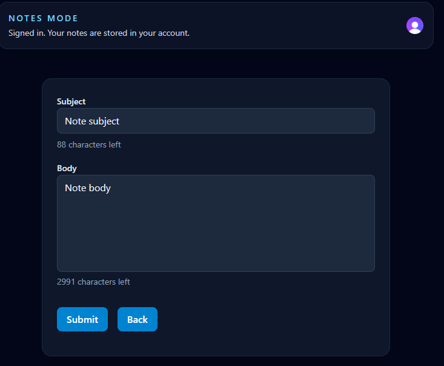
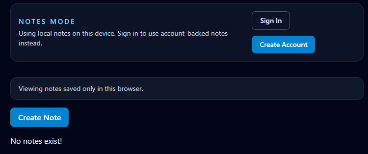

# Notes App

A full-stack notes application built with React, TypeScript, Express, PostgreSQL, Clerk, and `localStorage`.

Live demo: https://client-five-gray-80.vercel.app/

## Technologies Used

- React for the user interface
- TypeScript for type safety across the project
- React Router for client-side routing
- Tailwind CSS for styling
- Clerk for optional user authentication
- Express for the backend API
- PostgreSQL for storing signed-in users' notes
- Zod for request and form validation
- Vite for frontend development and builds

## What You Can Do With The App

- Create notes
- Edit notes
- Delete notes
- Use the app without creating an account
- Save notes locally in the browser with `localStorage`
- Sign in and save notes to your account
- View note creation and update timestamps
- Navigate between the notes list and note editor

## Local Development

- Run `npm run dev` from the root folder to start both the client and server
- Run `npm run dev:client` to start only the client
- Run `npm run dev:server` to start only the server

## Screenshots

Home page

  
Edit note page

  
Local storage mode home page

