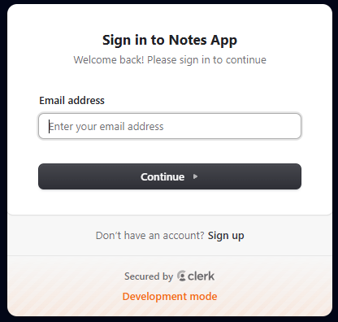
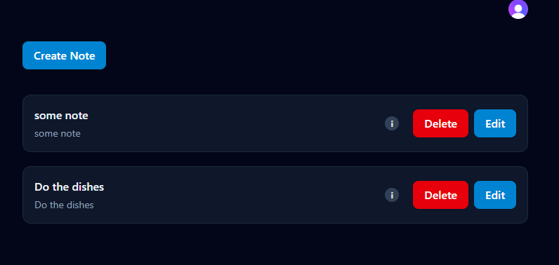
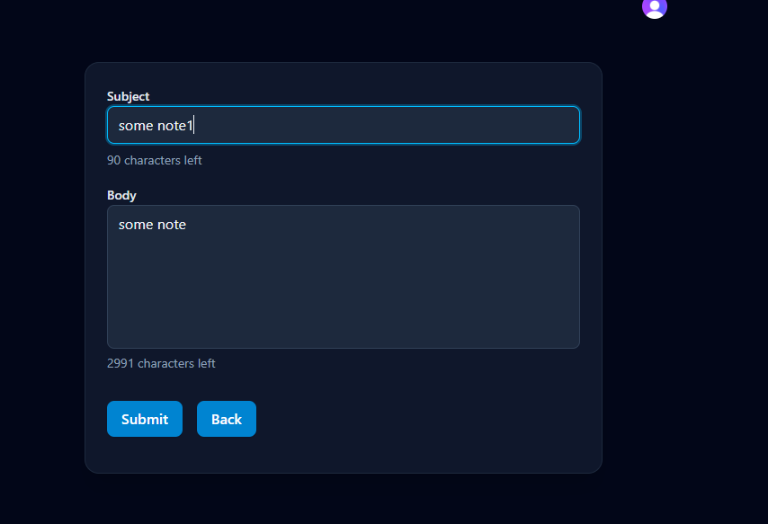

# Note Taking Web App

This is a note taking app made with React, TypeScript, Express.js, Express.js, and PostgreSQL.

- Every note has a subject and body. You can write notes and save them to your account.
- You can edit and delete notes at any time
- Each note has an updated and creation date
- The client handles server errors, like the server being unavailable
- Client side validation for forms
- Server rejects bad data and malformed requests

# App workflow:

